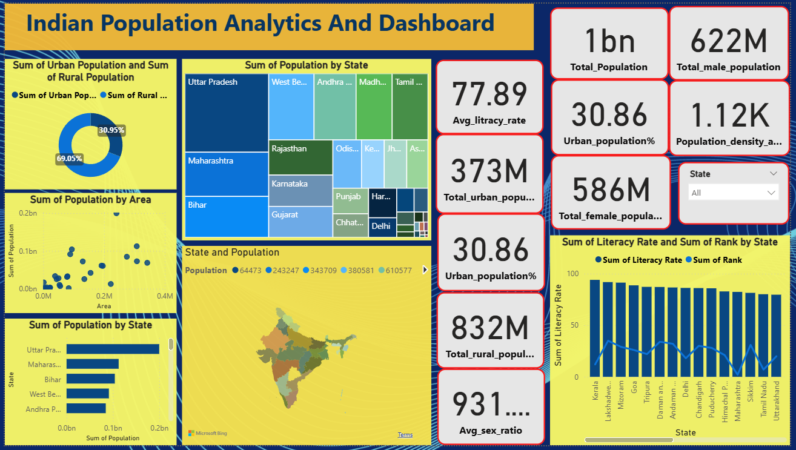

# Indian Population Analytics Dashboard

An interactive **Power BI dashboard** analyzing India's population distribution across all 35 states and union territories — covering demographics, literacy, urban-rural split, sex ratio, and population density.

> 📊 Built with Power BI · Dataset: Indian Census Data (35 States & UTs)

---

## 📸 Dashboard Preview



> *Interactive filters available for State-level drill-down in the Power BI file.*

---

## 📌 Project Overview

India's population data holds deep insights about regional development, literacy gaps, and demographic imbalances. This project visualizes that data in an intuitive, interactive dashboard to help answer questions like:

- Which states have the highest and lowest literacy rates?
- How is India's population split between urban and rural areas?
- Which states are the most densely populated?
- How does the sex ratio vary across states?

---

## 📊 Key Metrics at a Glance

| Metric | Value |
|--------|-------|
| 🧑‍🤝‍🧑 Total Population | ~1 Billion |
| 👨 Total Male Population | 622 Million |
| 👩 Total Female Population | 586 Million |
| 📚 Average Literacy Rate | 77.89% |
| 🏙️ Urban Population | 373 Million (30.86%) |
| 🌾 Rural Population | 832 Million (69.05%) |
| ⚖️ Average Sex Ratio | 931 females per 1000 males |
| 🗺️ Population Density (avg) | 1,120 per km² |

---

## 📈 Dashboard Visuals

| Visual | Description |
|--------|-------------|
| 🗺️ India Map | State-wise population density using filled map |
| 🌳 Treemap | Population distribution by state — top states at a glance |
| 🍩 Donut Chart | Urban vs Rural population split (30.95% vs 69.05%) |
| 📊 Bar Chart | Population ranking by state |
| 📉 Line + Bar Combo | Literacy rate and state rank comparison |
| 🔵 Scatter Plot | Population vs Area — identifying dense vs sparse states |
| 🃏 KPI Cards | 8 headline metrics for quick reference |
| 🔽 State Slicer | Filter all visuals by individual state |

---

## 🗂️ Repository Structure

```
Indian-Population-Analytics/
│
├── 📊 Indian_population_analytics_and_dashboard.pbix   # Power BI dashboard file
│
├── 📁 data/
│   └── population.csv                                  # Raw dataset (35 states & UTs)
│
├── 📁 screenshots/
│   └── dashboard.png                                   # Dashboard preview image
│
└── 📄 README.md                                        # Project documentation
```

---

## 📂 Dataset Details

**File:** `data/population.csv`  
**Source:** Indian Census Data  
**Records:** 35 States and Union Territories

### Columns

| Column | Description |
|--------|-------------|
| `Rank` | Population rank of the state |
| `State` | Name of the state / union territory |
| `Capital` | Capital city of the state |
| `Population` | Total population count |
| `% of Total Population` | Share of national population |
| `Males` | Total male population |
| `Females` | Total female population |
| `Sex Ratio` | Females per 1000 males |
| `Literacy Rate (%)` | Percentage of literate population |
| `Rural Population` | Population living in rural areas |
| `Urban Population` | Population living in urban areas |
| `Area (km²)` | Geographic area of the state |
| `Density (1/km²)` | Population per square kilometre |
| `Decadal Growth (%)` | Population growth over the last decade |

---

## 🔍 Key Insights

- **Uttar Pradesh** is the most populous state, followed by Maharashtra and Bihar
- **Bihar** has the highest population density at 1,102 per km²
- India is predominantly **rural** — nearly 69% of the population lives outside cities
- **Kerala** ranks highest in literacy; several northeastern states also perform well
- The national sex ratio of **931** reveals a persistent gender imbalance, especially in northern states
- **Lakshadweep and Sikkim** are the smallest states by population

---

## 🛠️ Tools Used

| Tool | Purpose |
|------|---------|
|  | Dashboard creation, DAX measures, visualizations |
|  | Initial data exploration and cleaning |
|  | Data querying and validation |

---

## 🚀 How to Open This Project

1. **Clone this repository**
   ```bash
   git clone https://github.com/9918Shivam/Indian-Population-Analytics.git
   ```

2. **Open the dashboard**
   - Download and install [Power BI Desktop](https://powerbi.microsoft.com/desktop/) (free)
   - Open `Indian_population_analytics_and_dashboard.pbix`

3. **Explore**
   - Use the **State slicer** to filter all visuals by a specific state
   - Hover over charts for detailed tooltips
   - Click on any state in the map or treemap to cross-filter all visuals

---

## 📬 Connect With Me

If you found this project helpful or have feedback, feel free to connect:

[](https://www.linkedin.com/in/shivam-chaurasiya-8515a722b/)
[](https://leetcode.com/u/omshivam9918/)


*Made with 📊 Power BI by Shivam Chaurasiya*
